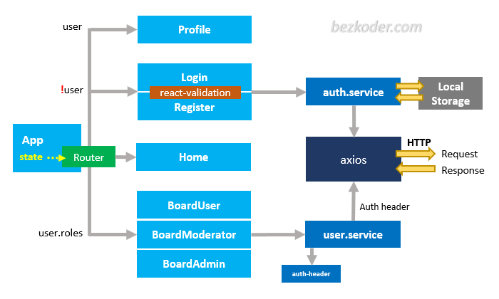

## React JWT Authentication (without Redux) example

React JWT Authentication example with LocalStorage, React Router, Axios and Bootstrap (without Redux)<br>

- JWT Authentication Flow for User Signup & User Login
- Project Structure for React JWT Authentication (without Redux) with LocalStorage, React Router & Axios
- Creating React Components with Form Validation
- React Components for accessing protected Resources (Authorization)
- Dynamic Navigation Bar in React App

## User Registration and User Login Flow
For JWT Authentication, we’re gonna call 2 endpoints:

- POST `api/auth/signup` for User Registration
- POST `api/auth/signin` for User Login


## React Component Diagram with Router, Axios & LocalStorage



## Project setup

In the project directory, you can run:

```
npm install
# or
yarn install
```

or

### Compiles and hot-reloads for development

```
npm start
# or
yarn start
```

Open [http://localhost:8081](http://localhost:8081) to view it in the browser.
